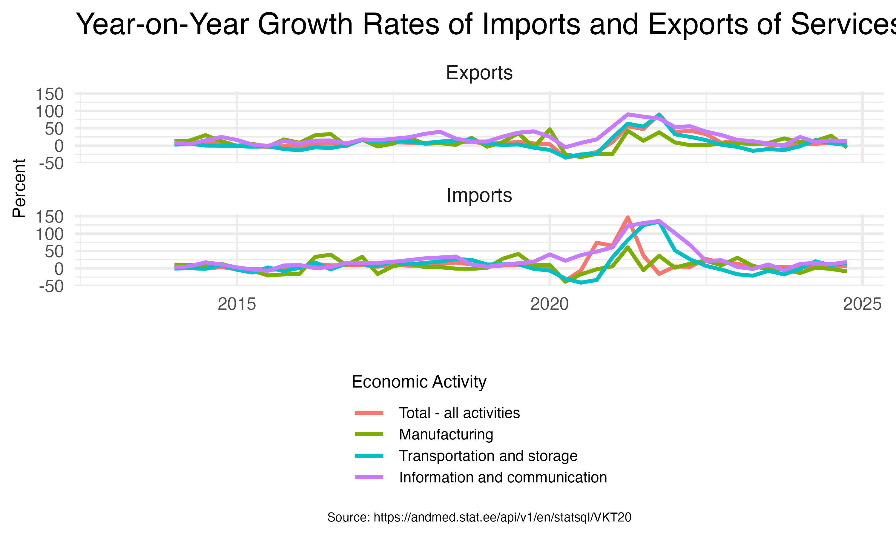

- [Disclaimer](#disclaimer)
- [Introduction](#introduction)
  - [**Setup**](#setup)
- [Data Access](#data-access)
  - [Interactive Data Access](#1-interactive-data-access)
  - [Direct Query](#direct-query)
  - [Creating Data Queries](#creating-data-queries)
    - [**How to Identify Query
      Variables**](#how-to-identify-query-variables)
    - [**Handling Missing List Fields Information**](#handling-missing-variables)
    - [**Using the Wildcard Operator**](#using-the-wildcard-operator)
    - [**Example Query**](#example-query)
  - [Structure and Properties of the `pxweb_data`
    Object](#structure-and-properties-of-the-pxweb_data-object)
  - [Working with the Downloaded
    Data](#working-with-the-downloaded-data)

---

### Disclaimer

This guide is an independent work and is not endorsed by Statistics
Estonia. The content presented here reflects the author’s personal
experience and interpretation of accessing Estonian statistical data
using R and the `pxweb` package.

It does **not represent the official opinions, documentation, or
guidelines of Statistics Estonia**. While Statistics Estonia
previously provided documentation on using `pxweb`, those materials
seem to have been since removed. The methods described in this guide are
based on publicly available information and the general functionality of
the `pxweb` R package.

For official guidance on Statistics Estonia’s data access, please refer
to their website: <https://andmed.stat.ee>.

---

# Introduction

This guide provides an overview of how to access the [Estonian
Statistical Office database](https://andmed.stat.ee/et/stat) using R.

To interact with the database, I recommend the **`pxweb`** R package.

**PXWEB** is an API system developed by **Statistics Sweden** and
adopted by various national statistical institutions (NSIs) to
provide structured access to public statistics. This API allows users to
download and use statistical data directly from government agencies
without needing to navigate a web browser.

The **`pxweb`** R package enables seamless integration with any PXWEB
API, allowing users to **query, retrieve, and reference** statistical
data efficiently.

---

## **Setup**

The **`pxweb`** package is the only required package for downloading
data.  
The additional packages listed below are optional and used for
visualization and additional functionality.

```r
# Load packages
library(pxweb)
library(tidyverse)
library(quarto)
library(gt)
library(plotly)
```

# Data Access

The `pxweb` package enables access to data in various ways, two of which
I will discuss in detail[^1]:

1. **Interactive Data Access:**  
   Use the `pxweb_interactive()` command to make selections in the
   database based on existing subdivisions. You’ll be prompted to
   choose the broadest groups of topics, then clarifications, and
   finally the method of presenting the results.

2. **Direct Query:**  
   Utilize the `pxweb_get()` function to directly query a table from
   the database. You can specify query parameters such as for example,
   NACE categories, stock or flow values or the time period for the
   data.

## 1 Interactive Data Access

Using the `pxweb_interactive()` command, it is possible to make
selections in the database according to the existing subdivisions.
First, you are asked to select the broadest categories of topics (see
the following console output screenshot), then the subcategories and
specific variable filters, and finally the method of presenting the
results.

For Statistics Estonia, the top-level database address is:

- In Estonian: <https://andmed.stat.ee/api/v1/et/stat>

- In English: <https://andmed.stat.ee/api/v1/en/stat>

Then start the interactive data explorer

```r
pxweb_interactive("https://andmed.stat.ee/api/v1/en/stat")
```

    ============================================================================================================================
     R PXWEB: Content of 'andmed.stat.ee'
              at '/api/v1/en/stat'
    ============================================================================================================================
     [ 1 ] : Environment
     [ 2 ] : Economy
     [ 3 ] : Population
     [ 4 ] : Social life
     [ 5 ] : Multidomain statistics
     [ 6 ] : Population and Housing Census
     [ 7 ] : Discontinued datasets
    ============================================================================================================================
    Enter your choice:
    ('esc' = Quit, 'b' = Back, 'i' = Show id)
    1:

Users can navigate the menu to select their desired options from the
available choices. Upon selecting the relevant data, the interactive
data explorer provides the functionality to transform the interactive
query into executable code. This code can be conveniently stored in an R
file, facilitating reproducibility, automatic updates, and report
generation.

    ============================================================================================================================
     R PXWEB: Content of 'andmed.stat.ee'
              at '/api/v1/en/stat/majandus/transport/maanteetransport/TS50.PX'
       TABLE: TS50: NATIONAL AND INTERNATIONAL ROAD FREIGHT TRANSPORT
    VARIABLE: Aasta, Veo liik, [[Näitaja]]
    ============================================================================================================================
     [1 ] : Freight, thousand tonnes
     [2 ] : Standard error of freight, thousand tonnes
     [3 ] : Relative standard error of freight, %
     [4 ] : Freight turnover, thousand tonne-km

     [6 ] : Relative standard error of freight turnover, %
     [7 ] : Run of loaded vehicles, thousand km
     [8 ] : Standard error of run of loaded vehicles, thousand km
     [9 ] : Relative standard error of run of loaded vehicles, %
    ============================================================================================================================
    Enter one or more choices:
    Separate multiple choices by ',' and intervals of choices by ':'
    ('esc' = Quit, 'b' = Back, '*' = Select all, 'a' = Show all, 'i' = Show id)
    1: *

    Do you want to print code to query and download data?
    Enter your choice:
    ('esc' = Quit, 'y' = Yes, 'n' = No)
    1: y
    Do you want to print query in json format (otherwise query is printed as an R list)?
    Enter your choice:
    ('esc' = Quit, 'y' = Yes, 'n' = No)
    1: n
    Do you want to download the data?
    Enter your choice:
    ('esc' = Quit, 'y' = Yes, 'n' = No)
    1: y
    Do you want to return a the data as a data.frame?
    Enter your choice:
    ('esc' = Quit, 'y' = Yes, 'n' = No)
    1: y
    Do you want to print citation for the data?
    Enter your choice:
    ('esc' = Quit, 'y' = Yes, 'n' = No)
    1: n

After selecting the desired options, the generated code snippet is
printed in the console.

```r
# PXWEB query
pxweb_query_list <-
  list("Aasta"=c("2010","2011","2012","2013","2014","2015","2016","2017","2018","2019","2020","2021","2022"),
       "Veo liik"=c("1"),
       "Näitaja"=c("1","2","3","4","5","6","7","8","9"))

# Download data
px_data <-
  pxweb_get(url = "https://andmed.stat.ee/api/v1/en/stat/majandus/transport/maanteetransport/TS50.PX",
            query = pxweb_query_list)

# Convert to data.frame
px_data_frame <- as.data.frame(px_data, column.name.type = "text", variable.value.type = "text")
```

From here on, we can work with the dataset in R.

## 2 Direct Query

If you already know the **table ID**, you can query the data directly. In this
example, we retrieve quarterly data on service exports and imports by
economic activity from the
[VKT20](https://andmed.stat.ee/en/statsql/majandus__valiskaubandus__teenuste_vk/VKT20)
table, which is part of the foreign trade section under the economy
category.[^2]

If `pxweb_get()` is used without a query, it returns either:

- A **PXWEB LEVELS object** (if the URL points to a dataset
  directory).
- A **PXWEB METADATA object** (if the URL points to a specific table).

Here’s an example of retrieving a **PXWEB LEVELS object**:

```r
# Get PXWEB levels
pxlist1 <- pxweb_get(url = "https://andmed.stat.ee/api/v1/en/statsql/VKT20")
pxlist1
```

    PXWEB METADATA
    Service value, million euros by flow, economic activity and quarter
    variables:
     [[1]] FLOW: flow
     [[2]] NACE_R2: economic activity
     [[3]] ContentsCode: indicator
     [[4]] TIME: quarter

This table follows a **long data format** and consists of four key
dimensions:

1. **FLOW** – Indicates the type of transaction: **Balance, Imports, or
   Exports**.
2. **NACE_R2** – Specifies the **economic activity** category.
3. **ContentsCode** – Represents the **values in million euros**,
   structured in a long format, stacked by the other three
   dimensions.
4. **TIME** – Contains **date values** as character strings.

To inspect the values of a specific field variable, we can check the
“FLOW” column:

```r
pxlist1$variables[[1]]
```

    $code
    [1] "FLOW"

    $text
    [1] "flow"

    $values
    [1] "EXP" "IMP" "BAL"

    $valueTexts
    [1] "Exports" "Imports" "Balance"

    $elimination
    [1] FALSE

    $time
    [1] FALSE

### Creating Data Queries

To download data, we need both the **table URL** and a **query**
specifying the required data fields. If no query is supplied, the API
returns only metadata about the dataset.[^3]

#### **How to Identify Query Variables**

The required **list variables** can be found in two ways:

1. **Programmatically** – The `pxlist1` object contains metadata
   outlining the required fields: _Flow_, _NACE_R2_, _ContentsCode_, and
   _Time_.
2. **Via the API** – Click **“API query for this table”** on the
   [Statistics Estonia data portal](https://andmed.stat.ee/et/stat) to view
   field arguments.

#### **Handling Missing Field Variables**

Sometimes, not all variables are listed on the Statistics Estonia website,
especially for **high-dimensional datasets** in **long format**. If a
required variable is missing, the query may fail. However, the error
message typically indicates the missing element, allowing users to
adjust the query accordingly.

#### **Using the Wildcard Operator**

To retrieve all available values for a given field, use the **wildcard
operator (`"*"`)** instead of specifying each value manually.

---

**Example Query**

In this example, we retrieve:

- Exports and Imports: ("FLOW" = c("EXP", "IMP"))
  - All economic categories: (`"NACE_R2" = "*"`)
  - All available content types: (`"ContentsCode" = "*"`) _(This field refers to units such as “Service value, million euros,”
    stored in long format.)_
  - All available time periods: (`"TIME" = "*"`)

```r
px_query_list1 <- list(
  "FLOW" = c("EXP", "IMP"),
  "NACE_R2" = "*",
  "ContentsCode" = "*",
  "TIME" = "*"
)
```

We can now pass the query list to the function call:

```r
px_VKT20 <-
  pxweb_get(url = "https://andmed.stat.ee/api/v1/en/statsql/VKT20",
            query = px_query_list1)
```

The function returns a **pxweb_data** object, which stores the
downloaded data in a list format.

---

#### Structure and Properties of the `pxweb_data` Object

Before using the data, we can inspect the structure of the downloaded
object.

The retrieved data is stored as a **nested list** within the
`pxweb_data` object.

```r
class(px_VKT20)
```

    [1] "pxweb_data" "list"

Calling the object provides a minimal summary of the dimensions of the
object.

```r
px_VKT20
```

    PXWEB DATA
    With 4 variables and 10656 observations.

Potential comments which are stored as metadata in the list can be
extracted.

```r
px_data_comments <- pxweb_data_comments(px_VKT20)
px_data_comments_df <- as.data.frame(px_data_comments)
```

We can extract, store and cite the data-query information.

```r
pcite <- pxweb_cite(px_VKT20)
```

    Statistics Estonia (2025). "Service value, million euros by flow,
    economic activity and quarter." [Data accessed 2025-03-07
    12:36:27.231629 using pxweb R package 0.17.0],
    <https://andmed.stat.ee/api/v1/en/statsql/VKT20>.

    A BibTeX entry for LaTeX users is

      @Misc{,
        title = {Service value, million euros by flow, economic activity and quarter},
        author = {{Statistics Estonia}},
        organization = {Statistics Estonia},
        address = {Tallinn, Estonia},
        year = {2025},
        url = {https://andmed.stat.ee/api/v1/en/statsql/VKT20},
        note = {[Data accessed 2025-03-07 12:36:27.231629 using pxweb R package 0.17.0]},
      }
    Kindly cite the pxweb R package as follows:

      Mans Magnusson, Markus Kainu, Janne Huovari, and Leo Lahti
      (rOpenGov).  pxweb: R tools for PXWEB API.  URL:
      http://github.com/ropengov/pxweb

    A BibTeX entry for LaTeX users is

      @Misc{,
        title = {pxweb: R tools for PX-WEB API},
        author = {Mans Magnusson and Markus Kainu and Janne Huovari and Leo Lahti},
        year = {2019},
      }

#### Working with the Downloaded Data

The downloaded **PXWEB data** can be converted into either a **data
frame** or a **character matrix**:

- A character matrix retains the raw data as text.
- A data frame returns a structured tidy format[^4], where missing
  values (e.g., `".."`) are automatically converted to `NA`.

Using the arguments `variable.value.type` and `column.name.type`, we can
specify whether we want **coded values** or **descriptive text** for
column names and data values.

Let’s extract the data, setting all columns as text, and reformat them
if necessary later.

```r
VKT20.df <- as.data.frame(px_VKT20, column.name.type = "text", variable.value.type = "text")
```

Alternatively, we can extract column labels and values as coded
values instead of text.  
This approach is often preferred during data cleaning.

```r
VKT20_code.df <- as.data.frame(px_VKT20, column.name.type = "code", variable.value.type = "code")
```

For example, if working with NACE codes, we can merge the `NACE`
column from the coded dataset with the text-based dataset.  
Since both data frames originate from the same object and have identical
dimensions, this process is straightforward.

```r
VKT20.df$nace <- VKT20_code.df$NACE_R2
```

Once the data is in a dataframe format, we can analyze it using our
preferred R workflow.

```r
# Create a temp dataframe with a subset of sectors, and reformat the date column
temp <- VKT20.df |>
  mutate(period = yq(quarter)) |>
    filter(str_detect(`economic activity`, "Total|Manufacturing|Transportation|Information and communication"))

# Alternative: filter by code

temp <- VKT20.df |>
  mutate(period = yq(quarter)) |>
    filter(nace %in% c("TOTAL", "C", "H", "J"))
```

Summary statistics:

```r
summary_stats <- temp %>%
  group_by(`economic activity`, flow) %>%
  summarise(
    Mean = mean(`Service value, million euros`, na.rm = TRUE),
    Median = median(`Service value, million euros`, na.rm = TRUE),
    SD = sd(`Service value, million euros`, na.rm = TRUE),

    Min = min(`Service value, million euros`, na.rm = TRUE),
    Max = max(`Service value, million euros`, na.rm = TRUE),
    N = n()
  )
```

```r
# Create gt table
# Reorder the rows to have "Total - all activities" first
summary_stats_reordered <- summary_stats %>%
  arrange(`economic activity` != "Total - all activities")

# Create gt table with formatted numerical columns
summary_table <- summary_stats_reordered %>%
  gt() %>%
  fmt_number(columns = where(is.numeric),
             decimals = 2) |>
  tab_header(title = "") |>   opt_stylize(style = 1, color = 'gray')

summary_table
```

**Summary Statistics of Imports and Exports of Services by Economic Activity**

<div id="cboyuapkyb" style="padding-left:0px;padding-right:0px;padding-top:10px;padding-bottom:10px;overflow-x:auto;overflow-y:auto;width:auto;height:auto;">
<style>#cboyuapkyb table {
  font-family: system-ui, 'Segoe UI', Roboto, Helvetica, Arial, sans-serif, 'Apple Color Emoji', 'Segoe UI Emoji', 'Segoe UI Symbol', 'Noto Color Emoji';
  -webkit-font-smoothing: antialiased;
  -moz-osx-font-smoothing: grayscale;
}
&#10;#cboyuapkyb thead, #cboyuapkyb tbody, #cboyuapkyb tfoot, #cboyuapkyb tr, #cboyuapkyb td, #cboyuapkyb th {
  border-style: none;
}
&#10;#cboyuapkyb p {
  margin: 0;
  padding: 0;
}
&#10;#cboyuapkyb .gt_table {
  display: table;
  border-collapse: collapse;
  line-height: normal;
  margin-left: auto;
  margin-right: auto;
  color: #333333;
  font-size: 16px;
  font-weight: normal;
  font-style: normal;
  background-color: #FFFFFF;
  width: auto;
  border-top-style: solid;
  border-top-width: 2px;
  border-top-color: #000000;
  border-right-style: none;
  border-right-width: 2px;
  border-right-color: #D3D3D3;
  border-bottom-style: solid;
  border-bottom-width: 2px;
  border-bottom-color: #000000;
  border-left-style: none;
  border-left-width: 2px;
  border-left-color: #D3D3D3;
}
&#10;#cboyuapkyb .gt_caption {
  padding-top: 4px;
  padding-bottom: 4px;
}
&#10;#cboyuapkyb .gt_title {
  color: #333333;
  font-size: 125%;
  font-weight: initial;
  padding-top: 4px;
  padding-bottom: 4px;
  padding-left: 5px;
  padding-right: 5px;
  border-bottom-color: #FFFFFF;
  border-bottom-width: 0;
}
&#10;#cboyuapkyb .gt_subtitle {
  color: #333333;
  font-size: 85%;
  font-weight: initial;
  padding-top: 3px;
  padding-bottom: 5px;
  padding-left: 5px;
  padding-right: 5px;
  border-top-color: #FFFFFF;
  border-top-width: 0;
}
&#10;#cboyuapkyb .gt_heading {
  background-color: #FFFFFF;
  text-align: center;
  border-bottom-color: #FFFFFF;
  border-left-style: none;
  border-left-width: 1px;
  border-left-color: #D3D3D3;
  border-right-style: none;
  border-right-width: 1px;
  border-right-color: #D3D3D3;
}
&#10;#cboyuapkyb .gt_bottom_border {
  border-bottom-style: solid;
  border-bottom-width: 2px;
  border-bottom-color: #5F5F5F;
}
&#10;#cboyuapkyb .gt_col_headings {
  border-top-style: solid;
  border-top-width: 2px;
  border-top-color: #5F5F5F;
  border-bottom-style: solid;
  border-bottom-width: 2px;
  border-bottom-color: #5F5F5F;
  border-left-style: none;
  border-left-width: 1px;
  border-left-color: #D3D3D3;
  border-right-style: none;
  border-right-width: 1px;
  border-right-color: #D3D3D3;
}
&#10;#cboyuapkyb .gt_col_heading {
  color: #333333;
  background-color: #FFFFFF;
  font-size: 100%;
  font-weight: normal;
  text-transform: inherit;
  border-left-style: none;
  border-left-width: 1px;
  border-left-color: #D3D3D3;
  border-right-style: none;
  border-right-width: 1px;
  border-right-color: #D3D3D3;
  vertical-align: bottom;
  padding-top: 5px;
  padding-bottom: 6px;
  padding-left: 5px;
  padding-right: 5px;
  overflow-x: hidden;
}
&#10;#cboyuapkyb .gt_column_spanner_outer {
  color: #333333;
  background-color: #FFFFFF;
  font-size: 100%;
  font-weight: normal;
  text-transform: inherit;
  padding-top: 0;
  padding-bottom: 0;
  padding-left: 4px;
  padding-right: 4px;
}
&#10;#cboyuapkyb .gt_column_spanner_outer:first-child {
  padding-left: 0;
}
&#10;#cboyuapkyb .gt_column_spanner_outer:last-child {
  padding-right: 0;
}
&#10;#cboyuapkyb .gt_column_spanner {
  border-bottom-style: solid;
  border-bottom-width: 2px;
  border-bottom-color: #5F5F5F;
  vertical-align: bottom;
  padding-top: 5px;
  padding-bottom: 5px;
  overflow-x: hidden;
  display: inline-block;
  width: 100%;
}
&#10;#cboyuapkyb .gt_spanner_row {
  border-bottom-style: hidden;
}
&#10;#cboyuapkyb .gt_group_heading {
  padding-top: 8px;
  padding-bottom: 8px;
  padding-left: 5px;
  padding-right: 5px;
  color: #333333;
  background-color: #FFFFFF;
  font-size: 100%;
  font-weight: initial;
  text-transform: inherit;
  border-top-style: solid;
  border-top-width: 2px;
  border-top-color: #5F5F5F;
  border-bottom-style: solid;
  border-bottom-width: 2px;
  border-bottom-color: #5F5F5F;
  border-left-style: none;
  border-left-width: 1px;
  border-left-color: #D3D3D3;
  border-right-style: none;
  border-right-width: 1px;
  border-right-color: #D3D3D3;
  vertical-align: middle;
  text-align: left;
}
&#10;#cboyuapkyb .gt_empty_group_heading {
  padding: 0.5px;
  color: #333333;
  background-color: #FFFFFF;
  font-size: 100%;
  font-weight: initial;
  border-top-style: solid;
  border-top-width: 2px;
  border-top-color: #5F5F5F;
  border-bottom-style: solid;
  border-bottom-width: 2px;
  border-bottom-color: #5F5F5F;
  vertical-align: middle;
}
&#10;#cboyuapkyb .gt_from_md > :first-child {
  margin-top: 0;
}
&#10;#cboyuapkyb .gt_from_md > :last-child {
  margin-bottom: 0;
}
&#10;#cboyuapkyb .gt_row {
  padding-top: 8px;
  padding-bottom: 8px;
  padding-left: 5px;
  padding-right: 5px;
  margin: 10px;
  border-top-style: none;
  border-top-width: 1px;
  border-top-color: #D5D5D5;
  border-left-style: none;
  border-left-width: 1px;
  border-left-color: #D5D5D5;
  border-right-style: none;
  border-right-width: 1px;
  border-right-color: #D5D5D5;
  vertical-align: middle;
  overflow-x: hidden;
}
&#10;#cboyuapkyb .gt_stub {
  color: #FFFFFF;
  background-color: #5F5F5F;
  font-size: 100%;
  font-weight: initial;
  text-transform: inherit;
  border-right-style: solid;
  border-right-width: 2px;
  border-right-color: #5F5F5F;
  padding-left: 5px;
  padding-right: 5px;
}
&#10;#cboyuapkyb .gt_stub_row_group {
  color: #333333;
  background-color: #FFFFFF;
  font-size: 100%;
  font-weight: initial;
  text-transform: inherit;
  border-right-style: solid;
  border-right-width: 2px;
  border-right-color: #D3D3D3;
  padding-left: 5px;
  padding-right: 5px;
  vertical-align: top;
}
&#10;#cboyuapkyb .gt_row_group_first td {
  border-top-width: 2px;
}
&#10;#cboyuapkyb .gt_row_group_first th {
  border-top-width: 2px;
}
&#10;#cboyuapkyb .gt_summary_row {
  color: #333333;
  background-color: #FFFFFF;
  text-transform: inherit;
  padding-top: 8px;
  padding-bottom: 8px;
  padding-left: 5px;
  padding-right: 5px;
}
&#10;#cboyuapkyb .gt_first_summary_row {
  border-top-style: solid;
  border-top-color: #5F5F5F;
}
&#10;#cboyuapkyb .gt_first_summary_row.thick {
  border-top-width: 2px;
}
&#10;#cboyuapkyb .gt_last_summary_row {
  padding-top: 8px;
  padding-bottom: 8px;
  padding-left: 5px;
  padding-right: 5px;
  border-bottom-style: solid;
  border-bottom-width: 2px;
  border-bottom-color: #5F5F5F;
}
&#10;#cboyuapkyb .gt_grand_summary_row {
  color: #333333;
  background-color: #D5D5D5;
  text-transform: inherit;
  padding-top: 8px;
  padding-bottom: 8px;
  padding-left: 5px;
  padding-right: 5px;
}
&#10;#cboyuapkyb .gt_first_grand_summary_row {
  padding-top: 8px;
  padding-bottom: 8px;
  padding-left: 5px;
  padding-right: 5px;
  border-top-style: double;
  border-top-width: 6px;
  border-top-color: #5F5F5F;
}
&#10;#cboyuapkyb .gt_last_grand_summary_row_top {
  padding-top: 8px;
  padding-bottom: 8px;
  padding-left: 5px;
  padding-right: 5px;
  border-bottom-style: double;
  border-bottom-width: 6px;
  border-bottom-color: #5F5F5F;
}
&#10;#cboyuapkyb .gt_striped {
  background-color: #F4F4F4;
}
&#10;#cboyuapkyb .gt_table_body {
  border-top-style: solid;
  border-top-width: 2px;
  border-top-color: #5F5F5F;
  border-bottom-style: solid;
  border-bottom-width: 2px;
  border-bottom-color: #5F5F5F;
}
&#10;#cboyuapkyb .gt_footnotes {
  color: #333333;
  background-color: #FFFFFF;
  border-bottom-style: none;
  border-bottom-width: 2px;
  border-bottom-color: #D3D3D3;
  border-left-style: none;
  border-left-width: 2px;
  border-left-color: #D3D3D3;
  border-right-style: none;
  border-right-width: 2px;
  border-right-color: #D3D3D3;
}
&#10;#cboyuapkyb .gt_footnote {
  margin: 0px;
  font-size: 90%;
  padding-top: 4px;
  padding-bottom: 4px;
  padding-left: 5px;
  padding-right: 5px;
}
&#10;#cboyuapkyb .gt_sourcenotes {
  color: #333333;
  background-color: #FFFFFF;
  border-bottom-style: none;
  border-bottom-width: 2px;
  border-bottom-color: #D3D3D3;
  border-left-style: none;
  border-left-width: 2px;
  border-left-color: #D3D3D3;
  border-right-style: none;
  border-right-width: 2px;
  border-right-color: #D3D3D3;
}
&#10;#cboyuapkyb .gt_sourcenote {
  font-size: 90%;
  padding-top: 4px;
  padding-bottom: 4px;
  padding-left: 5px;
  padding-right: 5px;
}
&#10;#cboyuapkyb .gt_left {
  text-align: left;
}
&#10;#cboyuapkyb .gt_center {
  text-align: center;
}
&#10;#cboyuapkyb .gt_right {
  text-align: right;
  font-variant-numeric: tabular-nums;
}
&#10;#cboyuapkyb .gt_font_normal {
  font-weight: normal;
}
&#10;#cboyuapkyb .gt_font_bold {
  font-weight: bold;
}
&#10;#cboyuapkyb .gt_font_italic {
  font-style: italic;
}
&#10;#cboyuapkyb .gt_super {
  font-size: 65%;
}
&#10;#cboyuapkyb .gt_footnote_marks {
  font-size: 75%;
  vertical-align: 0.4em;
  position: initial;
}
&#10;#cboyuapkyb .gt_asterisk {
  font-size: 100%;
  vertical-align: 0;
}
&#10;#cboyuapkyb .gt_indent_1 {
  text-indent: 5px;
}
&#10;#cboyuapkyb .gt_indent_2 {
  text-indent: 10px;
}
&#10;#cboyuapkyb .gt_indent_3 {
  text-indent: 15px;
}
&#10;#cboyuapkyb .gt_indent_4 {
  text-indent: 20px;
}
&#10;#cboyuapkyb .gt_indent_5 {
  text-indent: 25px;
}
&#10;#cboyuapkyb .katex-display {
  display: inline-flex !important;
  margin-bottom: 0.75em !important;
}
&#10;#cboyuapkyb div.Reactable > div.rt-table > div.rt-thead > div.rt-tr.rt-tr-group-header > div.rt-th-group:after {
  height: 0px !important;
}
</style>

|                               |          |          |        |          |          |       |
| ----------------------------- | -------- | -------- | ------ | -------- | -------- | ----- |
|                               | Mean     | Median   | SD     | Min      | Max      | N     |
| Total - all activities        |          |          |        |          |          |       |
| Exports                       | 1,889.96 | 1,582.30 | 689.86 | 1,074.40 | 3,267.00 | 48.00 |
| Imports                       | 1,446.90 | 1,160.15 | 589.03 | 797.10   | 2,535.90 | 48.00 |
| Information and communication |          |          |        |          |          |       |
| Exports                       | 412.38   | 247.70   | 333.80 | 100.10   | 1,122.90 | 48.00 |
| Imports                       | 251.68   | 123.10   | 227.87 | 62.90    | 766.20   | 48.00 |
| Manufacturing                 |          |          |        |          |          |       |
| Exports                       | 141.16   | 138.45   | 37.63  | 78.60    | 229.80   | 48.00 |
| Imports                       | 79.36    | 75.75    | 18.65  | 50.70    | 118.50   | 48.00 |
| Transportation and storage    |          |          |        |          |          |       |
| Exports                       | 480.50   | 429.15   | 110.51 | 326.20   | 699.50   | 48.00 |
| Imports                       | 241.71   | 205.55   | 88.63  | 144.50   | 404.30   | 48.00 |

</div>

Extract the URL for documenting the data source in the plot:

```r
source_url <- px_VKT20$url
```

Plot the data

```r
# Calculate Year-on-Year growth rates
temp_g <- temp |>
  group_by(flow, `economic activity`) %>%
  mutate(
    growth_rate = (
      `Service value, million euros` - lag(`Service value, million euros`, 4)
    ) / lag(`Service value, million euros`, 4) * 100
  )

temp_g$`economic activity` <- factor(temp_g$`economic activity`,
                                     levels = c("Total - all activities",
                                                "Manufacturing",
                                                "Transportation and storage",
                                                "Information and communication"))

p1 <- ggplot(data = temp_g, aes(x = period, y = growth_rate, color = `economic activity`)) +
  geom_line(linewidth = 1.5) +
  facet_wrap(~ flow, nrow = 2) +
  labs(
    x = "",
    y = "Percent",
    color = "Economic Activity",
    caption = paste("Source:", source_url)
  ) +
  ggtitle("Year-on-Year Growth Rates of Imports and Exports of Services by Economic Activity") +
  theme_minimal(base_size = 20) +
  theme(
    legend.position = "bottom",
    legend.direction = "vertical",
    legend.title = element_text(size = 14),
    legend.text = element_text(size = 12),
    legend.key.width = unit(1, "cm"),
    legend.spacing.y = unit(0.4, 'cm'),
    axis.text = element_text(size = 14),
    axis.title = element_text(size = 14),
    plot.caption = element_text(size = 10, hjust = 0.5)
  )

p1
```



```r
sessionInfo()
```

    R version 4.4.0 (2024-04-24)
    Platform: aarch64-apple-darwin20
    Running under: macOS 15.3.1

    Matrix products: default
    BLAS:   /Library/Frameworks/R.framework/Versions/4.4-arm64/Resources/lib/libRblas.0.dylib
    LAPACK: /Library/Frameworks/R.framework/Versions/4.4-arm64/Resources/lib/libRlapack.dylib;  LAPACK version 3.12.0

    locale:
    [1] en_US.UTF-8/en_US.UTF-8/en_US.UTF-8/C/en_US.UTF-8/en_US.UTF-8

    time zone: Europe/Tallinn
    tzcode source: internal

    attached base packages:
    [1] stats     graphics  grDevices utils     datasets  methods   base

    other attached packages:
     [1] plotly_4.10.4   gt_0.11.1       quarto_1.4.4    lubridate_1.9.4
     [5] forcats_1.0.0   stringr_1.5.1   dplyr_1.1.4     purrr_1.0.4
     [9] readr_2.1.5     tidyr_1.3.1     tibble_3.2.1    ggplot2_3.5.1
    [13] tidyverse_2.0.0 pxweb_0.17.0

    loaded via a namespace (and not attached):
     [1] sass_0.4.9        generics_0.1.3    xml2_1.3.6        stringi_1.8.4
     [5] hms_1.1.3         digest_0.6.37     magrittr_2.0.3    evaluate_1.0.3
     [9] grid_4.4.0        timechange_0.3.0  fastmap_1.2.0     jsonlite_1.9.0
    [13] processx_3.8.6    backports_1.5.0   ps_1.9.0          httr_1.4.7
    [17] viridisLite_0.4.2 scales_1.3.0      lazyeval_0.2.2    cli_3.6.4
    [21] rlang_1.1.5       munsell_0.5.1     withr_3.0.2       yaml_2.3.10
    [25] tools_4.4.0       tzdb_0.4.0        checkmate_2.3.2   colorspace_2.1-1
    [29] curl_6.2.1        vctrs_0.6.5       R6_2.6.1          lifecycle_1.0.4
    [33] htmlwidgets_1.6.4 pkgconfig_2.0.3   pillar_1.10.1     later_1.4.1
    [37] gtable_0.3.6      glue_1.8.0        data.table_1.17.0 Rcpp_1.0.14
    [41] xfun_0.51         tidyselect_1.2.1  rstudioapi_0.17.1 knitr_1.49
    [45] htmltools_0.5.8.1 rmarkdown_2.29    compiler_4.4.0

[^1]:
    Additional options include for example specifying the query in
    JSON and then importing the JSON file into R.

[^2]:
    Like other data providers, **Statistics Estonia periodically
    updates table names and structures**, which may affect existing
    code. For example, a recent revision changed [annual and quarterly
    labor market
    tables](https://www.stat.ee/en/news/information-api-users-labour-market-tables-changing-15-may).
    These changes are usually well-documented.

[^3]:
    The **list variables** are simply the table columns that store
    dataset values.

[^4]: The tidy format refers to a data structure where each variable is a column, each observation is a row, and each value is a cell. See Hadley Wickham’s Tidy Data principles for more details.
